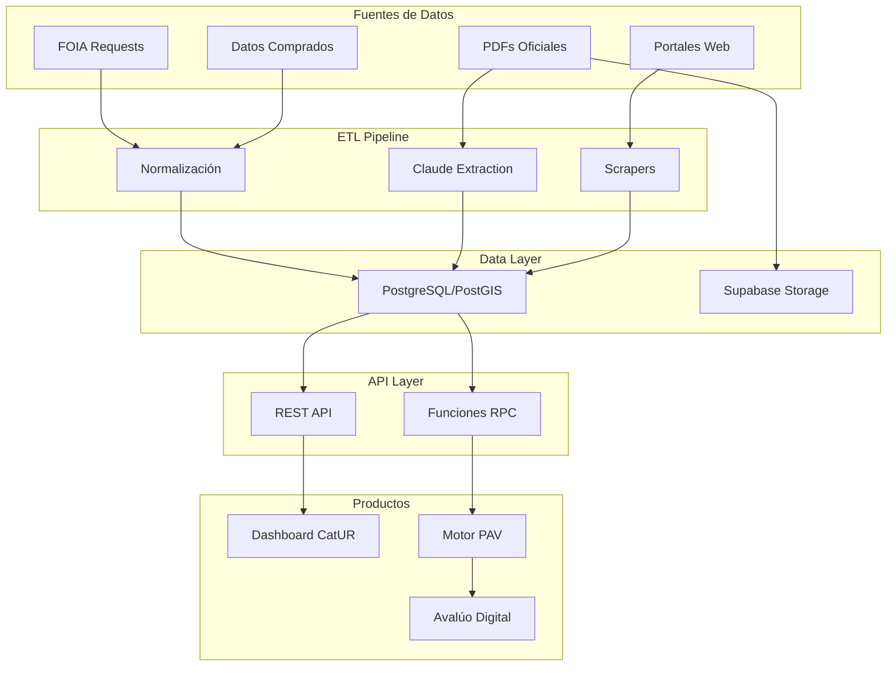
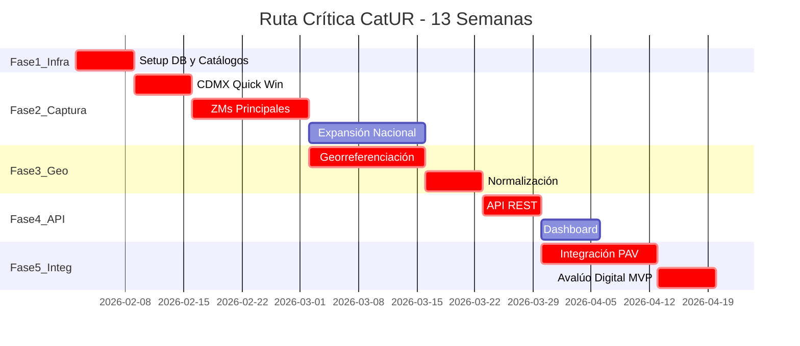
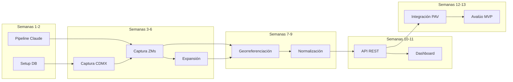

# Plan CatUR: Sistema de Consolidación Catastral en 13 Semanas

## Arquitectura General

---

## Ruta Crítica

**Tareas en ruta crítica (no pueden retrasarse):**

1. Setup DB (S1)
2. Captura CDMX (S2) 
3. ZMs Principales (S3-4)
4. Georreferenciación (S5-6)
5. Normalización (S7)
6. API REST (S8)
7. Integración PAV (S10-11)
8. Avalúo MVP (S12-13)

---

## FASE 1: Infraestructura (Semanas 1-2)

### Semana 1: Setup Base

| Día | Tarea | Entregable | Crítico |
|-----|-------|------------|---------|
| 1-2 | Crear proyecto Supabase + PostGIS | DB activa | Si |
| 3 | Schema SQL completo | Tablas creadas | Si |
| 4 | Cargar catálogo INEGI (estados, municipios) | 2,469 municipios | Si |
| 5 | Cargar AGEBs nacionales (shapefiles) | Geometrías base | Si |

### Semana 2: Pipelines Base

| Día | Tarea | Entregable | Crítico |
|-----|-------|------------|---------|
| 1-2 | Scraper genérico para portales web | Módulo reutilizable | No |
| 3-4 | Pipeline Claude para PDFs | Extractor funcional | Si |
| 5 | Storage para documentos fuente | Bucket configurado | No |

**Milestone S2:** Infraestructura lista para captura masiva

---

## FASE 2: Captura de Datos (Semanas 3-6)

### Semana 3: CDMX (Quick Win)

| Tarea | Zonas Esperadas | Fuente |
|-------|-----------------|--------|
| Valores unitarios CDMX | 3,000+ | datos.cdmx.gob.mx (CSV) |
| Colonias CDMX (geometrías) | 1,800 | sig.cdmx.gob.mx |
| Match zonas-colonias | 80% georeferenciado | Fuzzy matching |

**Milestone S3:** CDMX completa y funcional

### Semana 4-5: ZMs Principales (Top 10)

| ZM | Estado | Zonas Est. | Método |
|----|--------|------------|--------|
| Monterrey | NL | 800 | PDF + Claude |
| Guadalajara | JAL | 600 | PDF + Claude |
| Puebla | PUE | 400 | Web scraping |
| Querétaro | QRO | 300 | Portal directo |
| Tijuana | BC | 250 | PDF + Claude |
| León | GTO | 300 | PDF + Claude |
| Mérida | YUC | 250 | Portal directo |
| Cancún | QROO | 200 | PDF + Claude |
| SLP | SLP | 200 | PDF + Claude |
| Toluca | MEX | 400 | PDF + Claude |

**Milestone S5:** 10 ZMs capturadas (~6,500 zonas)

### Semana 6: Expansión

| Tarea | Zonas Adicionales |
|-------|-------------------|
| Municipios secundarios de ZMs | +2,000 |
| Estados con portales digitales | +1,500 |
| Solicitudes FOIA enviadas | 50 municipios |

**Milestone S6:** 10,000+ zonas, 150+ municipios

---

## FASE 3: Georreferenciación y Normalización (Semanas 7-9)

### Semana 7-8: Georreferenciación Masiva

| Método | Cobertura Esperada | Confiabilidad |
|--------|-------------------|---------------|
| Match exacto colonias oficiales | 40% | 0.95 |
| Fuzzy match AGEBs | 30% | 0.80 |
| Geocoding Google/OSM | 20% | 0.70 |
| Centroide municipal (fallback) | 10% | 0.30 |

**Milestone S8:** 90%+ zonas con alguna geometría

### Semana 9: Normalización de Valores

| Proceso | Descripción |
|---------|-------------|
| Conversión unidades | UDI → MXN donde aplique |
| Ajuste inflación | Todos a fecha base 2026-01-01 |
| Separación componentes | Suelo vs construcción |
| Score confiabilidad | Algoritmo multi-factor |
| Validación outliers | Detección de anomalías |

**Milestone S9:** Valores comparables cross-municipal

---

## FASE 4: API y Dashboard (Semanas 10-11)

### Semana 10: API REST

| Endpoint | Función |
|----------|---------|
| `GET /valor-catastral?lat&lng` | Consulta por coordenadas |
| `GET /zona/{id}` | Detalle de zona |
| `GET /municipio/{clave}/zonas` | Zonas por municipio |
| `POST /batch-query` | Consultas masivas |
| `GET /stats` | Estadísticas de cobertura |

### Semana 11: Dashboard

| Componente | Tecnología |
|------------|------------|
| Mapa interactivo | Mapbox/Deck.gl |
| Búsqueda por dirección | Google Places |
| Tabla de resultados | DataGrid |
| Exportación | CSV, JSON, PDF |
| Métricas de cobertura | Charts |

**Milestone S11:** Producto standalone usable

---

## FASE 5: Integración PAV/UbX y Avalúo (Semanas 12-13)

### Semana 12: Integración con Motor PAV

| Integración | Uso del Dato Catastral |
|-------------|------------------------|
| Variable `valor_suelo_base` | Input para cálculo PAV |
| Variable `brecha_catastral_mercado` | Indicador de distorsión |
| Función `get_comparables()` | Benchmark por cohorte |
| Score `confiabilidad_territorial` | Peso en fórmula PAV |

### Semana 13: Avalúo Digital MVP

| Componente | Descripción |
|------------|-------------|
| Input: Coordenadas + características | Formulario web |
| Proceso: CatUR + PAV + Comparables | Pipeline integrado |
| Output: Reporte de avalúo | PDF generado |
| Variantes: Mercado, Fiscal, Bancario | Ajustes por propósito |

**Milestone S13:** Avalúo digital funcional end-to-end

---

## Dependencias Críticas

---

## Recursos Requeridos

| Recurso | Semanas | Costo Estimado |
|---------|---------|----------------|
| Supabase Pro | 1-13 | $325 (25/mes) |
| Claude API | 3-9 | $400-600 |
| Google Maps API | 7-13 | $200-300 |
| Proxies residenciales | 3-6 | $200 |
| Datos comprados (opcional) | 3-6 | $1,500-3,000 |
| Mapbox (dashboard) | 10-13 | $0 (free tier) |
| **Total estimado** | | **$2,600-4,400** |

---

## Riesgos y Mitigación

| Riesgo | Probabilidad | Impacto | Mitigación |
|--------|--------------|---------|------------|
| PDFs mal formateados | Alta | Medio | Fallback a extracción manual top 50 |
| Bloqueo por scraping | Media | Alto | Proxies + rate limiting |
| Matching geográfico pobre | Media | Medio | Revisión manual zonas de alto valor |
| Datos FOIA tardíos | Alta | Bajo | No depender de FOIA en ruta crítica |
| Integración PAV compleja | Media | Alto | Buffer de 1 semana en S12 |

---

## Métricas de Éxito por Fase

| Fase | KPI | Target |
|------|-----|--------|
| Fase 1 | DB operativa | 100% |
| Fase 2 | Zonas capturadas | 10,000+ |
| Fase 2 | Municipios cubiertos | 150+ |
| Fase 3 | % georeferenciado | 85%+ |
| Fase 3 | % normalizado | 100% |
| Fase 4 | API latencia | menos de 200ms |
| Fase 5 | Avalúo generado | menos de 5 min |

---

## Entregables Finales (Semana 13)

1. **Base de datos CatUR** con 10,000+ zonas catastrales normalizadas
2. **API REST** para consultas por coordenadas y municipio
3. **Dashboard** de visualización y consulta
4. **Motor PAV integrado** con datos catastrales
5. **MVP Avalúo Digital** generando reportes para 3 propósitos
6. **Documentación técnica** completa
