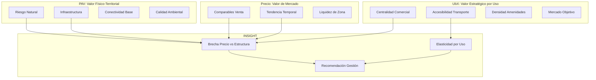
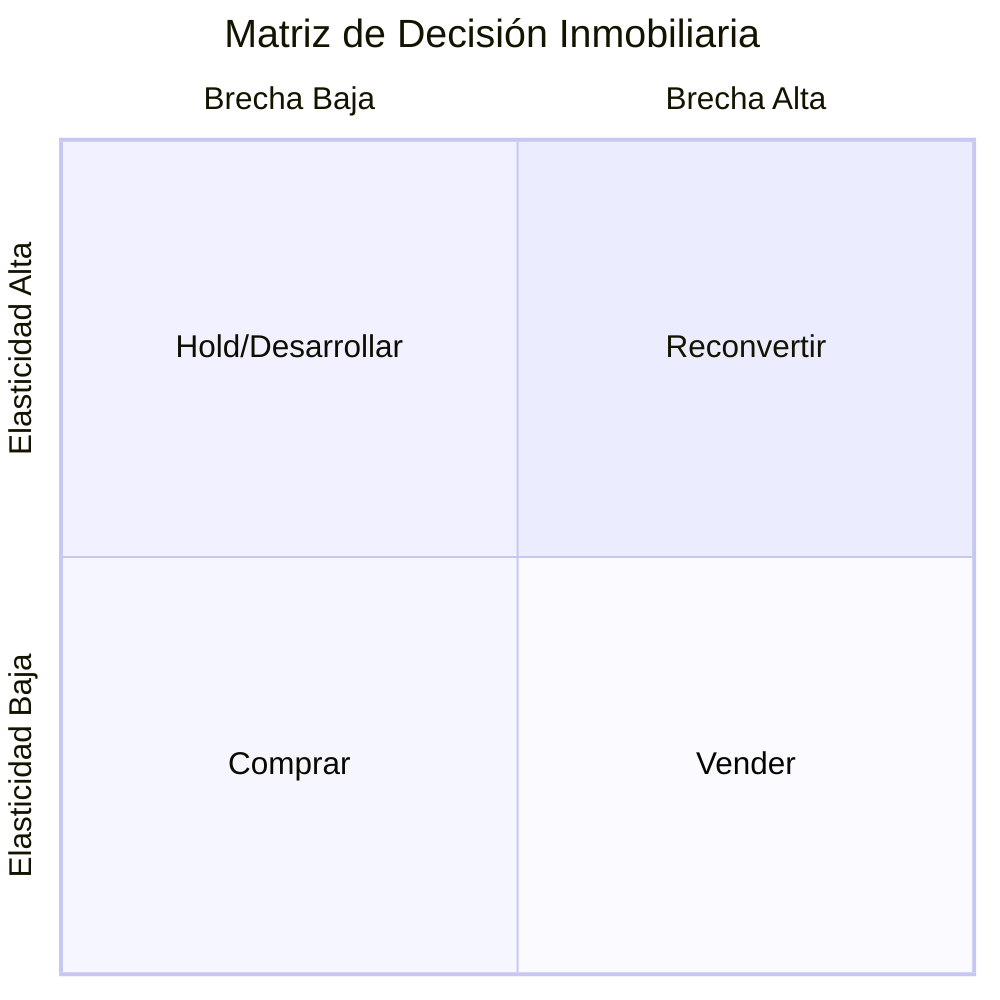
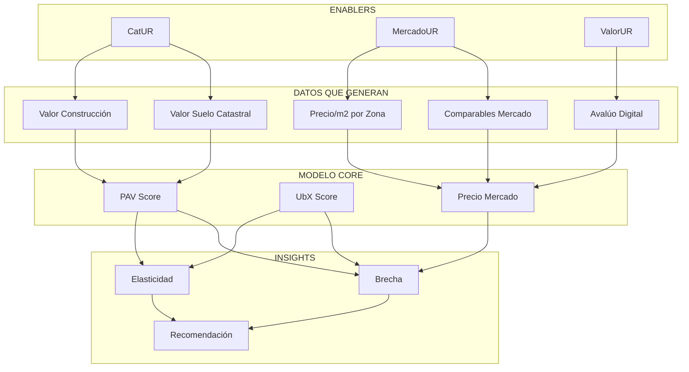
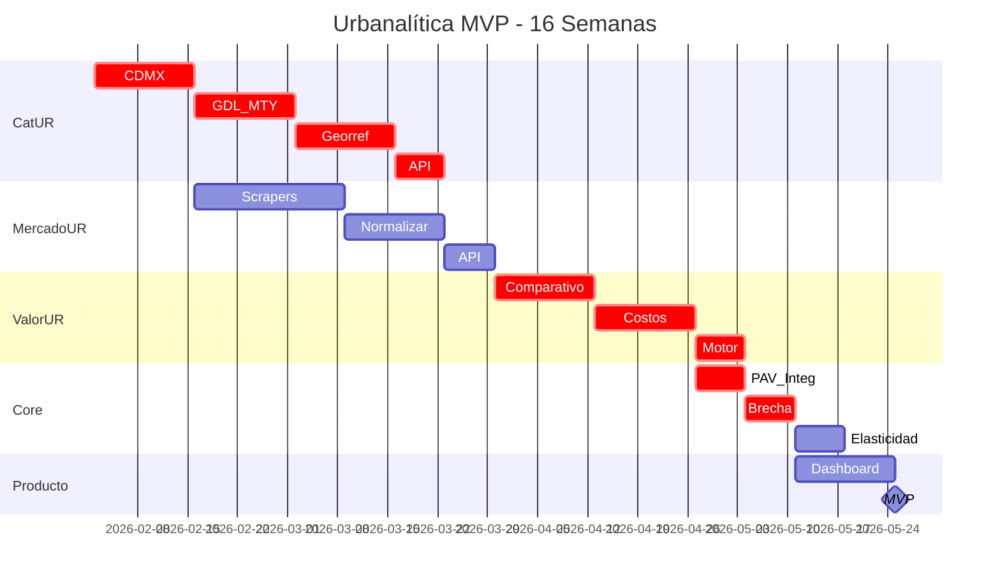

# Urbanalítica: Roadmap Completo

## Parte 1: Contexto y Descubrimientos de la Sesión

### El Camino que Recorrimos Hoy

Esta sesión comenzó explorando la documentación de Urbanalítica y evolucionó hacia el diseño de un plan de ejecución concreto. Los descubrimientos clave fueron:

**1. Entendiendo PAV y UbX**

Pregunta inicial: *"¿Qué es PAV y cómo es un subíndice dentro de UbX?"*

- **PAV (Physical Asset Value)**: Score 0-10 que mide la calidad estructural/territorial de un sitio, agnóstico al uso
- **UbX**: Score 0-10 que mide la aptitud estratégica para un uso específico
- **Relación jerárquica**: PAV es condición necesaria pero no suficiente para UbX alto

```
UbX = f(PAV, Centralidad, Accesibilidad, Mercado, Regulación)

Si PAV < umbral → UbX penalizado independientemente de otros factores
```

**2. La Diferencia en "Conectividad"**

Pregunta: *"¿Por qué se repite conectividad en PAV y en UbX?"*

| Conectividad PAV | Conectividad UbX |
|------------------|------------------|
| Estructural/física | Estratégica/topológica |
| "¿Hay rutas de acceso redundantes?" | "¿Qué tan central es para MI uso?" |
| Binaria: existe o no | Gradual: más o menos óptima |

**3. PAV es Territorial, No del Edificio**

Pregunta: *"¿PAV es independiente si es terreno o inmueble?"*

- PAV mide el LUGAR, no la construcción
- Aplica igual a terreno baldío que a edificio existente
- Variables: riesgo sísmico, inundación, infraestructura, accesos
- NO incluye: estado de conservación, calidad de acabados, antigüedad

**4. Cómo Entra el Precio**

Pregunta: *"¿Cómo entra el precio en todo esto?"*

El precio no es input del PAV/UbX, pero la **brecha** entre precio y valor estructural es el insight clave:

```
Brecha = (Precio_Mercado - Valor_Estructural) / Valor_Estructural

Valor_Estructural = f(PAV, UbX, Características_Físicas)
```

**5. El Problema Condesa (Credibilidad de Mercado)**

Pregunta: *"Si el modelo recomienda no comprar en Condesa por PAV bajo (riesgo sísmico), ¿perdemos credibilidad?"*

Insight clave: El modelo no está "equivocado", está revelando un **falso positivo del mercado**:

- El precio refleja lifestyle/demanda
- El PAV refleja riesgo estructural real
- El modelo no dice "no compres", dice "entiende qué estás comprando"

Reframe del pitch:

> "El mercado te cobra el lifestyle. Nadie te descuenta el riesgo. Nosotros te lo mostramos para que decidas con información completa."

**6. El Pivot: Digitalizar el Avalúo, No Complementarlo**

Pregunta: *"¿Podemos digitalizar el avalúo actual en lugar de solo complementarlo?"*

Insight: El quick win no es reinventar la valuación, sino:

1. Digitalizar el proceso analógico actual (espejo del real)
2. Luego agregar las variables diferenciadoras (esteroides)
3. Reducir de 7-15 días a 24-48 horas
4. Reducir de $5,000-15,000 a $500-2,000

**7. El Avalúo Universal**

Pregunta: *"¿Se puede crear un único avalúo que sirva para todos los propósitos?"*

Respuesta: Sí, con arquitectura de:

```
Valor_Base_Único × Factor_Propósito = Valor_Final

Factor_Propósito:
- Bancario: 0.85-0.95 (valor de realización)
- Fiscal: según tabla municipal
- Comercial venta: 1.00
- Comercial compra: 0.92-0.97
```

**8. El Bloqueo: Datos Catastrales Fragmentados**

Pregunta: *"¿Hay una base de datos nacional de valores catastrales?"*

Descubrimiento crítico: **NO EXISTE**

- 2,469 municipios gestionan su catastro independientemente
- SEDATU intentó consolidar en SNIGCA, falló
- Razones: 32 marcos legales, resistencia política, falta de presupuesto

Oportunidad: Construir lo que SEDATU no pudo = data moat competitivo

**9. La Decisión de Alcance MVP**

Corrección del plan: En lugar de 10 ZMs, enfocarse en 3 ciudades:

- CDMX + Guadalajara + Monterrey = 65% del mercado formal
- Suficiente para validar, más rápido de ejecutar

**10. El Enfoque de Ingresos NO es Estándar**

Corrección: El avalúo residencial tradicional solo usa:

- Enfoque comparativo (mercado)
- Enfoque de costos (físico)
- El enfoque de ingresos es para comercial/industrial

MVP debe ser espejo del real, no inventar complejidad.

---

## Parte 2: El Modelo Core de Urbanalítica

### La Ecuación Fundamental

```
┌─────────────────────────────────────────────────────────────────────────────┐
│                                                                             │
│                    PAV × UbX × Precio → Insight                             │
│                                                                             │
│   ┌─────────┐      ┌─────────┐      ┌─────────┐      ┌─────────────────┐   │
│   │   PAV   │      │   UbX   │      │ Precio  │      │    INSIGHT      │   │
│   │ 0-10    │  ×   │ 0-10    │  ×   │ MXN/m2  │  →   │                 │   │
│   │         │      │         │      │         │      │ Brecha          │   │
│   │ Valor   │      │ Valor   │      │ Valor   │      │ Elasticidad     │   │
│   │ Físico  │      │ Estraté-│      │ Mercado │      │ Recomendación   │   │
│   │         │      │ gico    │      │         │      │                 │   │
│   └─────────┘      └─────────┘      └─────────┘      └─────────────────┘   │
│                                                                             │
└─────────────────────────────────────────────────────────────────────────────┘
```

### Las Tres Dimensiones de Valor



### Brecha: El Insight Diferenciador

**Definición:**

```
Brecha = (Precio_Mercado - Valor_Estructural) / Valor_Estructural × 100%

Valor_Estructural = Valor_Catastral × Factor_PAV × Factor_UbX
```

**Interpretación:**

| Brecha | Significado | Acción Sugerida |
|--------|-------------|-----------------|
| > +30% | Altamente sobrevalorado | Cautela extrema / No comprar |
| +15% a +30% | Sobrevalorado | Negociar / Buscar alternativas |
| -10% a +15% | Fair value | Proceder con due diligence normal |
| -25% a -10% | Subvalorado | Oportunidad potencial |
| < -25% | Muy subvalorado | Investigar por qué (puede haber riesgo oculto) |

**Ejemplo Condesa:**

```
Precio mercado: $85,000 MXN/m2
Valor estructural: $52,000 MXN/m2 (PAV bajo por sismo)
Brecha: +63%

Interpretación: "El comprador paga 63% de prima por lifestyle. 
El riesgo sísmico no está descontado en el precio."
```

### Elasticidad: El Segundo Insight

**Definición:**

```
Elasticidad = ΔUbX / Δuso

"¿Cuánto cambia el valor estratégico si cambio el uso del inmueble?"
```

**Matriz de Elasticidad:**

| Desde / Hacia | Residencial | Comercial | Oficinas | Industrial |
|---------------|-------------|-----------|----------|------------|
| Residencial | - | +15% a +40% | +10% a +25% | -20% a +10% |
| Comercial | -30% a -10% | - | -5% a +10% | -40% a -20% |
| Terreno | Variable | Variable | Variable | Variable |

**Uso de la Elasticidad:**

```
Si UbX_residencial = 6.5/10
Y  UbX_comercial = 8.2/10
→  Elasticidad = +26%

Recomendación: "Este inmueble residencial tiene potencial 
de +26% en valor estratégico si se reconvierte a comercial.
Verificar regulación de uso de suelo."
```

### La Recomendación de Gestión

Combinando Brecha + Elasticidad:



| Cuadrante | Brecha | Elasticidad | Recomendación |
|-----------|--------|-------------|---------------|
| 1 | Alta (sobrevalorado) | Alta | Reconvertir uso para capturar elasticidad |
| 2 | Baja (fair/sub) | Alta | Hold y desarrollar el potencial |
| 3 | Baja (subvalorado) | Baja | Comprar, valor actual es oportunidad |
| 4 | Alta (sobrevalorado) | Baja | Vender, precio no se sostiene |

---

## Parte 3: Arquitectura de Enablers

### Cómo se Conecta Todo



### Rol de Cada Enabler

| Enabler | Qué Aporta | A Qué Componente Core |
|---------|------------|----------------------|
| **CatUR** | Valores unitarios suelo, valores construcción, zonas georreferenciadas | PAV (baseline territorial) |
| **MercadoUR** | Comparables, precios/m2, tendencias, liquidez | Precio (referencia mercado) |
| **ValorUR** | Avalúo digitalizado, enfoques comparativo y costos | Precio (estimación formal) |

---

## Parte 4: Roadmap de Ejecución - 16 Semanas

### Vista General



### Semanas 1-7: CatUR (Datos Catastrales)

**Objetivo:** Base de datos de valores catastrales para CDMX, Guadalajara y Monterrey.

| Semana | Tarea | Entregable |
|--------|-------|------------|
| 1-2 | Captura CDMX (CSV público + shapefiles) | 3,000+ zonas |
| 3-4 | Captura GDL + MTY (PDFs + Claude) | 2,000+ zonas |
| 5-6 | Georreferenciación (AGEBs + geocoding) | 85% con geometría |
| 7 | API de consulta espacial | Endpoint funcional |

**Schema de datos:**

```sql
zonas_catastrales (
  id, municipio_id, nombre_zona,
  valor_suelo_m2, valor_construccion_m2,
  geom, confiabilidad, fecha_publicacion
)
```

### Semanas 3-8: MercadoUR (Comparables)

**Objetivo:** Base de comparables de mercado en tiempo real para 3 ciudades.

| Semana | Tarea | Entregable |
|--------|-------|------------|
| 3-5 | Scrapers: Inmuebles24, Vivanuncios, MC | Pipeline funcionando |
| 6-7 | Normalización y deduplicación | 50K+ listings limpios |
| 8 | API de comparables | Endpoint con estadísticas |

**Schema de datos:**

```sql
listings (
  id, portal, url, precio, precio_m2,
  m2_terreno, m2_construccion, tipo,
  lat, lng, fecha_captura
)
```

### Semanas 9-13: ValorUR (Motor de Valuación)

**Objetivo:** Replicar el avalúo tradicional con 2 enfoques.

| Semana | Tarea | Entregable |
|--------|-------|------------|
| 9-10 | Enfoque comparativo | Valor por comparables homologados |
| 11-12 | Enfoque de costos | Valor por terreno + construcción depreciada |
| 13 | Ponderador | Valor conclusivo ponderado |

**Fórmulas implementadas:**

```
Valor_Comparativo = Mediana(Comparables × Factores_Homologación)
Valor_Costos = (m2_terreno × Valor_CatUR) + (m2_const × Costo_Tipo × (1-Depreciación))
Valor_Final = (Comparativo × 0.6) + (Costos × 0.4)  // Para casa usada
```

### Semanas 14-16: Modelo Core + Dashboard

**Objetivo:** Integrar PAV/UbX, calcular brecha y elasticidad, visualizar insights.

| Semana | Tarea | Entregable |
|--------|-------|------------|
| 14 | Integración PAV existente | Score PAV por coordenada |
| 15 | Cálculo de Brecha | Precio vs Valor Estructural |
| 16 | Dashboard de Insight | UI con recomendación |

**Cálculos implementados:**

```
Valor_Estructural = Valor_Catastral × (PAV/10) × Factor_Zona
Brecha = (Precio_Mercado - Valor_Estructural) / Valor_Estructural
Recomendación = f(Brecha, Elasticidad, Horizonte_Inversión)
```

---

## Parte 5: Criterios de Éxito del MVP

### Métricas Técnicas

| Componente | KPI | Target |
|------------|-----|--------|
| CatUR | Zonas capturadas | 5,000+ |
| CatUR | % georeferenciado | 85%+ |
| MercadoUR | Listings activos | 50,000+ |
| ValorUR | Error vs avalúo real | menos de 15% |
| Core | Latencia consulta | menos de 500ms |

### Métricas de Negocio

| Métrica | Target MVP |
|---------|------------|
| Usuarios piloto | 5-10 |
| Consultas generadas | 500+ |
| NPS de insight | mayor a 50 |
| Clientes dispuestos a pagar | 3+ |

### Hipótesis a Validar

| Hipótesis | Cómo Validamos | Éxito |
|-----------|----------------|-------|
| Podemos capturar datos catastrales | CatUR funcional | 3 ciudades cubiertas |
| Podemos replicar el avalúo | Comparar con avalúos reales | Error menos de 15% |
| La brecha es insight valioso | Feedback cualitativo | "Esto no lo sabía" |
| Clientes pagarían | Piloto comercial | Al menos 1 venta |

---

## Parte 6: Qué Sigue Después del MVP

### Fase 2: Expansión (Semanas 17-28)

| Componente | Expansión |
|------------|-----------|
| CatUR | +7 ciudades (top 10 ZMs completas) |
| MercadoUR | +Rentas para enfoque ingresos |
| ValorUR | +Enfoque ingresos (comercial) |
| Core | Elasticidad multi-uso completa |

### Fase 3: Producto Comercial (Semanas 29-40)

| Feature | Descripción |
|---------|-------------|
| Portal cliente | Solicitud, tracking, pago, descarga |
| Firma digital | Certificación legal del avalúo |
| API partners | Para bancos, notarías, brokers |
| Reporte completo | PDF con todos los insights |

### Fase 4: Inteligencia Avanzada (Semanas 41+)

| Feature | Descripción |
|---------|-------------|
| Predicción de precio | ML sobre tendencias |
| Alerta de oportunidades | Notificación cuando brecha es atractiva |
| Portafolio management | Gestión de múltiples activos |
| Escenarios de inversión | Simulación de reconversión |

---

## Parte 7: Recursos y Equipo

### Presupuesto MVP (16 semanas)

| Concepto | Costo USD |
|----------|-----------|
| Supabase (infra) | $100 |
| Claude API (extracción) | $300 |
| Google Maps API | $150 |
| Proxies scraping | $100 |
| Contingencia | $150 |
| **Total** | **$800** |

### Equipo Mínimo

| Rol | Dedicación | Semanas |
|-----|------------|---------|
| Tech Lead / Full Stack | 100% | 1-16 |
| Consultor valuación | 10% | 9-16 |

### Herramientas

| Herramienta | Uso |
|-------------|-----|
| Supabase | DB PostgreSQL/PostGIS + API |
| Claude API | Extracción de PDFs |
| Python | Scrapers y pipeline |
| Streamlit | Dashboard MVP |

---

## Resumen Ejecutivo

**Urbanalítica** está construyendo inteligencia territorial para decisiones inmobiliarias. El modelo core combina:

- **PAV**: Qué tan bueno es el lugar físicamente
- **UbX**: Qué tan estratégico es para un uso específico
- **Precio**: Qué dice el mercado
- **Brecha**: ¿El precio refleja el valor real?
- **Elasticidad**: ¿Qué uso maximiza el valor?

Para llegar ahí, necesitamos enablers que hoy no existen:

- **CatUR**: Datos catastrales que el gobierno no consolidó
- **MercadoUR**: Comparables normalizados en tiempo real
- **ValorUR**: Avalúo digital que replica el proceso tradicional

El MVP de 16 semanas cubre 3 ciudades (65% del mercado), replica el avalúo estándar (2 enfoques), y entrega el insight diferenciador: **la brecha entre precio y valor estructural**.

Post-MVP, expandimos cobertura, agregamos enfoque de ingresos para comercial, y desarrollamos la elasticidad completa para recomendaciones de reconversión de uso.
