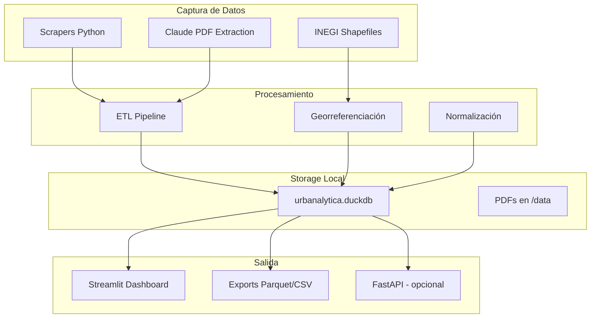
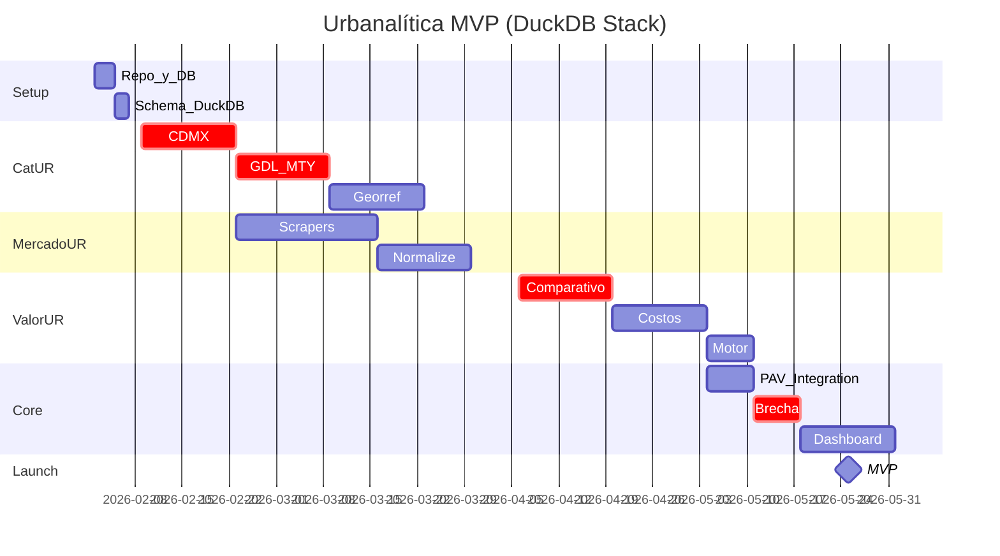

# Urbanalítica MVP: Stack DuckDB

## Cambio Principal: DuckDB en lugar de Supabase

| Aspecto | Antes (Supabase) | Ahora (DuckDB) |
|---------|------------------|----------------|
| Base de datos | PostgreSQL hosted | DuckDB local |
| GIS | PostGIS | DuckDB Spatial |
| API | Supabase REST auto | FastAPI (si se necesita) |
| Costo | $25/mes | $0 |
| Setup | Cuenta + config | `pip install duckdb` |
| Archivo | Cloud | `urbanalytica.duckdb` |

---

## Arquitectura MVP con DuckDB



---

## Stack Técnico MVP

```
urbanalytica/
├── urbanalytica.duckdb      # Base de datos única
├── data/
│   ├── raw/                 # PDFs, CSVs originales
│   ├── processed/           # Parquet intermedios
│   └── shapefiles/          # AGEBs, colonias
├── src/
│   ├── db.py                # Clase DuckDB wrapper
│   ├── catur/               # Módulo catastral
│   │   ├── capture_cdmx.py
│   │   ├── capture_gdl.py
│   │   ├── capture_mty.py
│   │   └── georef.py
│   ├── mercadour/           # Módulo mercado
│   │   ├── scrapers/
│   │   └── normalize.py
│   ├── valorur/             # Módulo valuación
│   │   ├── comparativo.py
│   │   ├── costos.py
│   │   └── motor.py
│   └── core/                # Modelo core
│       ├── pav.py
│       ├── brecha.py
│       └── insight.py
├── dashboard/
│   └── app.py               # Streamlit
├── requirements.txt
└── README.md
```

### requirements.txt

```
# Core
duckdb>=1.0.0
pandas>=2.0.0
polars>=0.20.0           # Alternativa rápida a pandas

# Spatial
geopandas>=0.14.0
shapely>=2.0.0

# Scraping
httpx>=0.27.0
selectolax>=0.3.0        # Parser HTML rápido
playwright>=1.40.0       # Para JS rendering

# AI
anthropic>=0.25.0

# Dashboard
streamlit>=1.32.0
pydeck>=0.8.0            # Mapas
plotly>=5.18.0

# Utils
python-dotenv>=1.0.0
loguru>=0.7.0
```

---

## Schema DuckDB con Spatial

```sql
-- Extensiones
INSTALL spatial;
LOAD spatial;

-- Estados
CREATE TABLE estados (
    id INTEGER PRIMARY KEY,
    clave_inegi CHAR(2) UNIQUE NOT NULL,
    nombre VARCHAR(100) NOT NULL
);

-- Municipios
CREATE TABLE municipios (
    id INTEGER PRIMARY KEY,
    estado_id INTEGER REFERENCES estados(id),
    clave_inegi CHAR(5) UNIQUE NOT NULL,
    nombre VARCHAR(200) NOT NULL,
    es_mvp BOOLEAN DEFAULT FALSE  -- CDMX, GDL, MTY
);

-- Zonas Catastrales (CatUR)
CREATE TABLE zonas_catastrales (
    id INTEGER PRIMARY KEY,
    municipio_id INTEGER,
    clave_zona VARCHAR(50),
    nombre_zona VARCHAR(300),
    tipo_zona VARCHAR(50),
    
    -- Valores MXN/m2
    valor_suelo DECIMAL(12,2),
    valor_construccion_economica DECIMAL(12,2),
    valor_construccion_media DECIMAL(12,2),
    valor_construccion_buena DECIMAL(12,2),
    
    -- Geo
    geom GEOMETRY,
    centroide GEOMETRY,
    
    -- Metadata
    fecha_publicacion DATE,
    fuente VARCHAR(200),
    confiabilidad DECIMAL(3,2),
    created_at TIMESTAMP DEFAULT CURRENT_TIMESTAMP
);

-- Índice espacial
CREATE INDEX idx_zonas_geom ON zonas_catastrales USING RTREE (geom);

-- Listings de Mercado (MercadoUR)
CREATE TABLE listings (
    id VARCHAR PRIMARY KEY,  -- portal_id
    portal VARCHAR(50),
    tipo VARCHAR(50),        -- casa, depto, terreno
    operacion VARCHAR(20),   -- venta, renta
    
    precio DECIMAL(14,2),
    precio_m2 DECIMAL(12,2),
    m2_terreno DECIMAL(10,2),
    m2_construccion DECIMAL(10,2),
    recamaras INTEGER,
    banos DECIMAL(3,1),
    
    -- Ubicación
    lat DECIMAL(10,7),
    lng DECIMAL(10,7),
    colonia VARCHAR(200),
    municipio VARCHAR(100),
    
    -- Metadata
    url TEXT,
    fecha_publicacion DATE,
    fecha_captura DATE DEFAULT CURRENT_DATE,
    activo BOOLEAN DEFAULT TRUE
);

CREATE INDEX idx_listings_coords ON listings (lat, lng);

-- Avalúos generados (ValorUR)
CREATE TABLE avaluos (
    id INTEGER PRIMARY KEY,
    
    -- Input
    lat DECIMAL(10,7),
    lng DECIMAL(10,7),
    tipo_inmueble VARCHAR(50),
    m2_terreno DECIMAL(10,2),
    m2_construccion DECIMAL(10,2),
    edad_años INTEGER,
    estado_conservacion VARCHAR(20),
    
    -- Cálculos
    valor_comparativo DECIMAL(14,2),
    valor_costos DECIMAL(14,2),
    valor_conclusivo DECIMAL(14,2),
    
    -- Core insight
    pav_score DECIMAL(3,1),
    valor_estructural DECIMAL(14,2),
    brecha_porcentaje DECIMAL(5,2),
    recomendacion VARCHAR(50),
    
    created_at TIMESTAMP DEFAULT CURRENT_TIMESTAMP
);
```

---

## Clase Wrapper DuckDB

```python
# src/db.py
import duckdb
from pathlib import Path
from typing import Optional
import pandas as pd

class UrbanalyticaDB:
    """Wrapper para DuckDB con extensión spatial"""
    
    def __init__(self, db_path: str = "urbanalytica.duckdb"):
        self.db_path = Path(db_path)
        self.con = duckdb.connect(str(self.db_path))
        self._setup_extensions()
    
    def _setup_extensions(self):
        """Instalar y cargar extensiones necesarias"""
        self.con.execute("INSTALL spatial; LOAD spatial;")
        self.con.execute("INSTALL httpfs; LOAD httpfs;")  # Para leer de URLs
    
    def execute(self, query: str, params: list = None):
        """Ejecutar query con parámetros opcionales"""
        if params:
            return self.con.execute(query, params)
        return self.con.execute(query)
    
    def query_df(self, query: str, params: list = None) -> pd.DataFrame:
        """Ejecutar query y retornar DataFrame"""
        result = self.execute(query, params)
        return result.fetchdf()
    
    # === CatUR Methods ===
    
    def get_valor_catastral(self, lat: float, lng: float, radio_km: float = 1.0):
        """Obtener valor catastral por coordenadas"""
        radio_deg = radio_km / 111  # Aproximación grados
        
        return self.query_df("""
            SELECT 
                nombre_zona,
                valor_suelo,
                valor_construccion_media,
                confiabilidad,
                ST_Distance(centroide, ST_Point(?, ?)) * 111 as distancia_km
            FROM zonas_catastrales
            WHERE ST_DWithin(geom, ST_Point(?, ?), ?)
            ORDER BY distancia_km
            LIMIT 5
        """, [lng, lat, lng, lat, radio_deg])
    
    def insert_zona_catastral(self, data: dict):
        """Insertar zona catastral con geometría WKT"""
        self.execute("""
            INSERT INTO zonas_catastrales 
            (municipio_id, clave_zona, nombre_zona, tipo_zona,
             valor_suelo, valor_construccion_media, geom, confiabilidad, fuente)
            VALUES (?, ?, ?, ?, ?, ?, ST_GeomFromText(?), ?, ?)
        """, [
            data['municipio_id'], data.get('clave_zona'), data['nombre_zona'],
            data.get('tipo_zona', 'mixto'), data['valor_suelo'],
            data.get('valor_construccion_media'), data.get('geom_wkt'),
            data.get('confiabilidad', 0.8), data.get('fuente')
        ])
    
    # === MercadoUR Methods ===
    
    def get_comparables(self, lat: float, lng: float, tipo: str, radio_km: float = 1.0):
        """Obtener comparables de mercado"""
        radio_deg = radio_km / 111
        
        return self.query_df("""
            SELECT 
                id, precio, precio_m2, m2_construccion,
                recamaras, banos, colonia,
                SQRT(POW((lat - ?) * 111, 2) + POW((lng - ?) * 111 * COS(RADIANS(?)), 2)) as distancia_km
            FROM listings
            WHERE tipo = ?
              AND operacion = 'venta'
              AND activo = TRUE
              AND ABS(lat - ?) < ? AND ABS(lng - ?) < ?
            ORDER BY distancia_km
            LIMIT 20
        """, [lat, lng, lat, tipo, lat, radio_deg, lng, radio_deg])
    
    def get_estadisticas_zona(self, lat: float, lng: float, radio_km: float = 1.0):
        """Estadísticas de precio por zona"""
        radio_deg = radio_km / 111
        
        return self.query_df("""
            SELECT 
                COUNT(*) as n_listings,
                MEDIAN(precio_m2) as precio_m2_mediana,
                QUANTILE_CONT(precio_m2, 0.25) as precio_m2_p25,
                QUANTILE_CONT(precio_m2, 0.75) as precio_m2_p75,
                MIN(precio_m2) as precio_m2_min,
                MAX(precio_m2) as precio_m2_max
            FROM listings
            WHERE operacion = 'venta'
              AND activo = TRUE
              AND ABS(lat - ?) < ? AND ABS(lng - ?) < ?
        """, [lat, radio_deg, lng, radio_deg])
    
    # === Export Methods ===
    
    def export_parquet(self, table: str, path: str):
        """Exportar tabla a Parquet"""
        self.execute(f"COPY {table} TO '{path}' (FORMAT PARQUET)")
    
    def backup(self, path: str):
        """Backup completo de la DB"""
        self.execute(f"EXPORT DATABASE '{path}'")
```

---

## Pipeline de Captura Actualizado

### Captura CDMX con DuckDB

```python
# src/catur/capture_cdmx.py
import httpx
import pandas as pd
from src.db import UrbanalyticaDB

def capture_cdmx_valores():
    """Capturar valores unitarios CDMX desde datos abiertos"""
    
    db = UrbanalyticaDB()
    
    # URL datos abiertos CDMX
    url = "https://datos.cdmx.gob.mx/dataset/.../valores_unitarios_2026.csv"
    
    # Descargar directamente con DuckDB (más eficiente)
    db.execute(f"""
        CREATE OR REPLACE TABLE cdmx_raw AS
        SELECT * FROM read_csv_auto('{url}')
    """)
    
    # Transformar e insertar
    db.execute("""
        INSERT INTO zonas_catastrales 
        (municipio_id, nombre_zona, tipo_zona, valor_suelo, fuente)
        SELECT 
            (SELECT id FROM municipios WHERE nombre = cdmx_raw.alcaldia),
            cdmx_raw.colonia,
            cdmx_raw.uso_suelo,
            cdmx_raw.valor_m2_suelo,
            'datos.cdmx.gob.mx'
        FROM cdmx_raw
    """)
    
    # Limpiar tabla temporal
    db.execute("DROP TABLE cdmx_raw")
    
    print(f"CDMX: {db.query_df('SELECT COUNT(*) FROM zonas_catastrales').iloc[0,0]} zonas")
```

### Extracción PDF con Claude + DuckDB

```python
# src/catur/capture_gdl.py
import anthropic
import base64
from pdf2image import convert_from_path
from src.db import UrbanalyticaDB

def extract_valores_pdf(pdf_path: str, municipio: str, estado: str):
    """Extraer valores de PDF usando Claude y guardar en DuckDB"""
    
    client = anthropic.Anthropic()
    db = UrbanalyticaDB()
    
    # Obtener municipio_id
    mun_id = db.query_df(
        "SELECT id FROM municipios WHERE nombre = ?", 
        [municipio]
    ).iloc[0, 0]
    
    # Convertir PDF a imágenes
    images = convert_from_path(pdf_path, dpi=150)
    
    for i, image in enumerate(images):
        # Encode imagen
        import io
        buffer = io.BytesIO()
        image.save(buffer, format="PNG")
        img_b64 = base64.standard_b64encode(buffer.getvalue()).decode()
        
        # Llamar Claude
        response = client.messages.create(
            model="claude-sonnet-4-20250514",
            max_tokens=4096,
            messages=[{
                "role": "user",
                "content": [
                    {"type": "image", "source": {"type": "base64", "media_type": "image/png", "data": img_b64}},
                    {"type": "text", "text": f"""
Extrae los valores catastrales de esta imagen.
Municipio: {municipio}, Estado: {estado}

Responde SOLO con JSON array:
[{{"nombre_zona": "string", "valor_suelo": numero, "tipo_zona": "habitacional|comercial|industrial|mixto"}}]

Si no hay datos, responde: []
"""}
                ]
            }]
        )
        
        # Parsear e insertar
        import json
        try:
            zonas = json.loads(response.content[0].text)
            for zona in zonas:
                db.insert_zona_catastral({
                    'municipio_id': mun_id,
                    'nombre_zona': zona['nombre_zona'],
                    'valor_suelo': zona['valor_suelo'],
                    'tipo_zona': zona.get('tipo_zona', 'mixto'),
                    'fuente': f'PDF {pdf_path} - Claude extraction',
                    'confiabilidad': 0.85
                })
        except json.JSONDecodeError:
            print(f"Error parsing page {i+1}")
    
    print(f"{municipio}: zonas insertadas")
```

---

## Dashboard Streamlit con DuckDB

```python
# dashboard/app.py
import streamlit as st
import pandas as pd
import pydeck as pdk
from src.db import UrbanalyticaDB

st.set_page_config(page_title="Urbanalítica", layout="wide")

# Conexión a DuckDB
@st.cache_resource
def get_db():
    return UrbanalyticaDB()

db = get_db()

st.title("Urbanalítica - Inteligencia Territorial")

# Sidebar: Input de ubicación
st.sidebar.header("Consulta")
lat = st.sidebar.number_input("Latitud", value=19.4326, format="%.6f")
lng = st.sidebar.number_input("Longitud", value=-99.1332, format="%.6f")
tipo = st.sidebar.selectbox("Tipo de inmueble", ["departamento", "casa", "terreno"])

if st.sidebar.button("Analizar"):
    col1, col2, col3 = st.columns(3)
    
    # CatUR: Valor catastral
    catastral = db.get_valor_catastral(lat, lng)
    if not catastral.empty:
        col1.metric("Valor Catastral", f"${catastral.iloc[0]['valor_suelo']:,.0f}/m²")
        col1.caption(f"Zona: {catastral.iloc[0]['nombre_zona']}")
    
    # MercadoUR: Precio mercado
    stats = db.get_estadisticas_zona(lat, lng)
    if not stats.empty and stats.iloc[0]['n_listings'] > 0:
        col2.metric("Precio Mercado", f"${stats.iloc[0]['precio_m2_mediana']:,.0f}/m²")
        col2.caption(f"Basado en {stats.iloc[0]['n_listings']} comparables")
    
    # Core: Brecha
    if not catastral.empty and not stats.empty:
        valor_catastral = catastral.iloc[0]['valor_suelo']
        precio_mercado = stats.iloc[0]['precio_m2_mediana']
        brecha = (precio_mercado - valor_catastral) / valor_catastral * 100
        
        col3.metric("Brecha", f"{brecha:+.1f}%")
        if brecha > 30:
            col3.warning("Sobrevalorado")
        elif brecha < -10:
            col3.success("Subvalorado")
        else:
            col3.info("Fair value")
    
    # Mapa
    st.subheader("Ubicación")
    comparables = db.get_comparables(lat, lng, tipo)
    
    # Punto de consulta
    view_state = pdk.ViewState(latitude=lat, longitude=lng, zoom=14)
    
    layers = [
        pdk.Layer(
            "ScatterplotLayer",
            data=[{"lat": lat, "lng": lng}],
            get_position=["lng", "lat"],
            get_color=[255, 0, 0, 200],
            get_radius=50,
        )
    ]
    
    if not comparables.empty:
        layers.append(pdk.Layer(
            "ScatterplotLayer",
            data=comparables,
            get_position=["lng", "lat"],
            get_color=[0, 100, 255, 150],
            get_radius=30,
        ))
    
    st.pydeck_chart(pdk.Deck(layers=layers, initial_view_state=view_state))
    
    # Tabla de comparables
    if not comparables.empty:
        st.subheader("Comparables cercanos")
        st.dataframe(comparables[['precio', 'precio_m2', 'm2_construccion', 'colonia', 'distancia_km']])
```

---

## Roadmap Actualizado: 16 Semanas con DuckDB

### Timeline



### Semana por Semana

| Semana | Tarea Principal | Entregable |
|--------|-----------------|------------|
| 1 | Setup repo + DuckDB + schema | Estructura funcionando |
| 2 | Captura CDMX valores + colonias | 3,000+ zonas |
| 3 | Captura Guadalajara (Claude) | 1,000+ zonas |
| 4 | Captura Monterrey (Claude) | 1,000+ zonas |
| 5 | Georreferenciación AGEBs | Match zonas-geometrías |
| 6 | Normalización + QA datos | Datos limpios |
| 7 | Scrapers Inmuebles24 | Pipeline funcionando |
| 8 | Scrapers Vivanuncios + MC | 3 portales |
| 9 | Normalización listings | 50K+ limpios |
| 10 | Motor enfoque comparativo | Valor por comparables |
| 11 | Motor enfoque costos | Valor por costos |
| 12 | Ponderador + valor conclusivo | Motor completo |
| 13 | Integración PAV | Score PAV por coords |
| 14 | Cálculo de brecha | Insight funcional |
| 15 | Dashboard Streamlit | UI navegable |
| 16 | Testing + fixes + docs | MVP listo |

---

## Costos Actualizados

| Concepto | Costo |
|----------|-------|
| DuckDB | $0 |
| Claude API (extracción ~100 PDFs) | $50-100 |
| Proxies scraping (opcional) | $50 |
| **Total MVP** | **$50-150 USD** |

vs. $800 con Supabase

---

## Ventajas del Stack DuckDB

1. **Velocidad de iteración**: Sin esperar deploys, todo local
2. **Portabilidad**: Un archivo `.duckdb` que puedes versionar
3. **Performance**: Queries analíticas más rápidas (columnar)
4. **Costo**: $0 en infraestructura
5. **Simplicidad**: Menos moving parts

## Cuándo Migrar a PostgreSQL/Supabase

- Cuando tengas usuarios externos accediendo
- Cuando necesites API pública 24/7
- Cuando el equipo crezca (+2 devs concurrentes)
- Cuando pases de MVP a producto

La migración será simple: DuckDB exporta a Parquet, PostgreSQL importa.

---

## Resumen del Stack Final

```
┌─────────────────────────────────────────────────────────────┐
│                    STACK MVP URBANALÍTICA                    │
├─────────────────────────────────────────────────────────────┤
│                                                              │
│   Python 3.11+                                               │
│   ├── DuckDB 1.0+ (con spatial)     ← Base de datos         │
│   ├── Anthropic SDK                  ← Extracción PDFs      │
│   ├── httpx + playwright             ← Scraping             │
│   ├── geopandas                      ← Geo processing       │
│   └── Streamlit                      ← Dashboard            │
│                                                              │
│   Costo total: ~$100 USD                                     │
│   Tiempo: 16 semanas                                         │
│   Resultado: MVP funcional con insight diferenciador         │
│                                                              │
└─────────────────────────────────────────────────────────────┘
```
